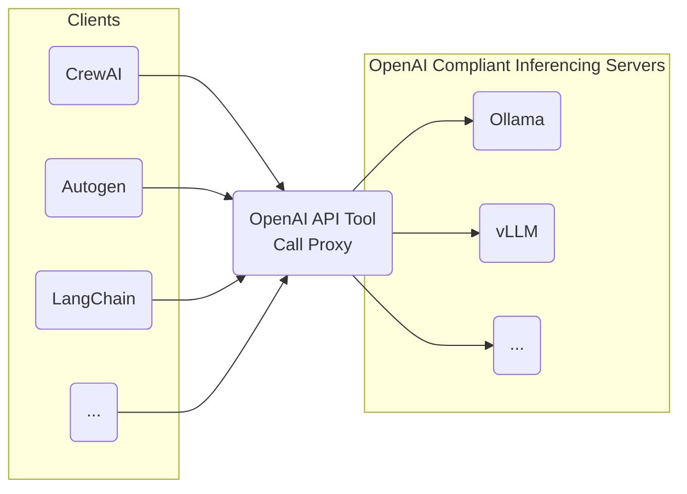

# openai_api_tool_call_proxy
Ideally, tool calls should be handled on the inferencing server side using tool call templates rather than the client agents.  Because it is particularly difficult to support a large variety of open models and their respective client code/model specifics, both inferencing servers and agent libraries coverage for support is bad.  This is a OpenAI API thin proxy PoC to support prompt/message handling of tool calls for OpenAI API-compliant local APIs which do not support tool calls.  This tool enables you to effectively add tool call support to OpenAI API servers from local inferencing servers like Ollama/vLLM/etc and then to use them to perform tool calls with agent libraries.



# Running the Examples
In your virtual environment:
```
pip install -U -r requirements.txt
pip install -U -r examples/requirements.txt
```

In one terminal:
```bash
cd examples
./start_vllm_inference_server.sh
```

In a second terminal:
```bash
cd examples
./start_proxy.sh
```

In a third terminal, run the examples:
```bash
```

# Current Support and Testing
This is a PoC so expect it to be limited.  Currently only tested with vLLM/Ollama using [Hermes 2 Pro Llama 3 8B](https://huggingface.co/NousResearch/Hermes-2-Pro-Llama-3-8B) and agent libraries Autogen and LangChain.
