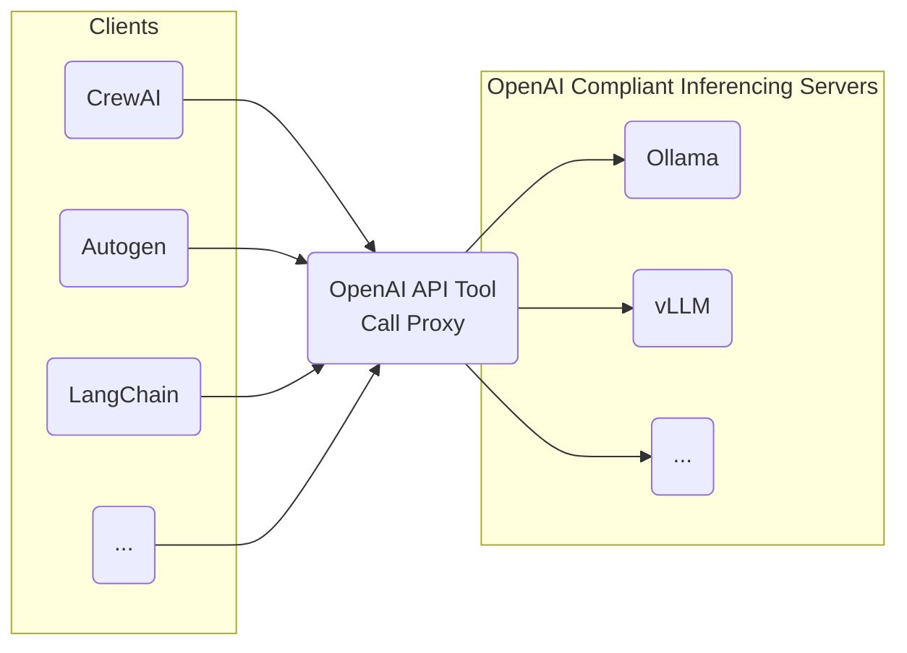

# openai_api_tool_call_proxy
Ideally, tool calls should be handled on the inferencing server side using tool call templates rather than the client agents.  Because it is particularly difficult to support a large variety of open models and their respective client code/model specifics, both inferencing servers and agent libraries coverage for support is bad.  This is a OpenAI API thin proxy PoC to support prompt/message handling of tool calls for OpenAI API-compliant local APIs which do not support tool calls.  This tool enables you to effectively add tool call support to OpenAI API servers from local inferencing servers like Ollama/vLLM/etc and then to use them to perform tool calls with agent libraries.



# Running the Examples
In your virtual environment, set up the deps:
```
pip install -U -r requirements.txt
pip install -U -r examples/requirements.txt
```

## Start an Inferencing Server
In one terminal (you can skip this and run whatever server, just point the proxy's `UPSTREAM` at your local OpenAI API endpoint):
```bash
cd examples
./start_vllm_inference_server.sh
```

## Start the Proxy
In a second terminal:
```bash
cd examples
./start_proxy.sh
```

## Run a Tool Call
In a third terminal, run the examples:
```bash
$ python langchain_function_call.py 
[{'args': {'x': 500, 'y': 1234},
  'id': 'call_FjvUyvXJIpXS7QkhKqarJgqg',
  'name': 'add'},
 {'args': {'x': 35},
  'id': 'call_tqJaK0qBIqV40rbbIS6ifyNe',
  'name': 'factorial'}]
add_ints: 1734
factorial_int: 10333147966386144929666651337523200000000
```


```bash
$ python autogen_function_call.py 
user_proxy (to chatbot):

How much is 500 * 1234? Reply 'TERMINATE' once you have the answer.

--------------------------------------------------------------------------------
chatbot (to user_proxy):


***** Suggested tool call (call_67aBtJ6zhDoweIC7xTulAsVz): multiply_ints *****
Arguments: 
{"x": 500, "y": 1234}
******************************************************************************

--------------------------------------------------------------------------------

>>>>>>>> EXECUTING FUNCTION multiply_ints...
user_proxy (to chatbot):

user_proxy (to chatbot):

***** Response from calling tool (call_67aBtJ6zhDoweIC7xTulAsVz) *****
617000
**********************************************************************

--------------------------------------------------------------------------------
chatbot (to user_proxy):

The product of 500 and 1234 is 617000. Please let me know if you need assistance with anything else.

--------------------------------------------------------------------------------
user_proxy (to chatbot):


--------------------------------------------------------------------------------
chatbot (to user_proxy):

TERMINATE

--------------------------------------------------------------------------------
```

# Current Support and Testing
This is an afternoon PoC project so expect it to be limited.  Currently only tested with vLLM/Ollama using [Hermes 2 Pro Llama 3 8B](https://huggingface.co/NousResearch/Hermes-2-Pro-Llama-3-8B) and agent libraries Autogen and LangChain.
